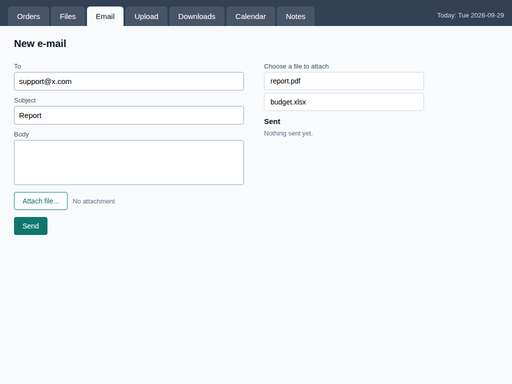

# Computer Use Agent

[](https://github.com/Juadsuarezsan/computer-use-agent/actions/workflows/ci.yml)
[-brightgreen)](eval/RESULTS.md)
[](LICENSE)
[](https://juadsuarezsan.github.io/computer-use-agent/demo/)
[](src/config.py)

**Demo:** https://juadsuarezsan.github.io/computer-use-agent/demo/ (static replay of 20 recorded
runs; see [Demo](#demo)) · **Results:** [`eval/RESULTS.md`](eval/RESULTS.md) · **Safety:**
[`docs/safety.md`](docs/safety.md)

## What this project does

You describe a task in plain language ("fill the support form with subject X", "open invoice
INV-2024-017 and tell me the total"). The agent looks at a screenshot of a sandboxed screen,
decides one mouse or keyboard action, executes it, looks again, and repeats until the task is
done. Every proposed action goes through a safety filter first, and every step is stored in an
audit log with its screenshot, reasoning and cost. Success is not what the agent claims: it is
checked against the application's actual state.

## Industrial use case

Back-office teams in banking, insurance and logistics still operate systems with **no API**:
a 2005 ERP behind a Citrix session, a supplier portal, an internal admin console. Today a person
reads the screen and types. This agent is the software equivalent of that person, with three
properties an RPA bot lacks: it works from pixels (no brittle selectors on someone else's UI), it
explains each action, and it is fenced by a deterministic safety layer plus a human-in-the-loop
policy for payments, mass deletion and external e-mail. Concrete flows covered by the eval set:
submitting forms, extracting figures from a legacy table, navigating an admin dashboard, and
multi-step workflows such as "export the orders as CSV and upload the file" or "find
`report.pdf` and e-mail it to support".

## Architecture


`observe → verify → reason → safety → execute` as a LangGraph loop; the reasoner is Claude with
the `computer_20250124` tool (or a scripted stub offline); the VM is a headless-Chromium
sandbox over four fixture web apps (or an Xvfb desktop driven by `xdotool`/`scrot` in Docker);
ground truth comes from DOM checkers; the audit log is PostgreSQL or SQLite. Details in
[`docs/architecture.md`](docs/architecture.md).

## Metrics and results

From [`eval/RESULTS.md`](eval/RESULTS.md), regenerated by `python -m eval.run` from
`eval/runs/2026-09-29-*.json`. **The measured rows use the `StubReasoner`, a scripted DOM-oracle
baseline with no LLM: they validate the sandbox, executor, checkers and safety layer, not the
model.** The Claude rows need `ANTHROPIC_API_KEY` and are not invented.

| Categoría de tarea | Success Rate | Avg Steps | Latencia (media / p95) | Costo/tarea |
|---|---|---|---|---|
| Form filling | 100% (5/5) | 9.2 | 1.04 s / 1.18 s | $0.0000 (sin LLM) |
| Data extraction | 100% (5/5) | 2.6 | 0.26 s / 0.31 s | $0.0000 (sin LLM) |
| Web navigation | 100% (5/5) | 6.6 | 0.59 s / 0.88 s | $0.0000 (sin LLM) |
| Multi-step workflow | 100% (5/5) | 7.6 | 0.72 s / 1.06 s | $0.0000 (sin LLM) |
| **Total (stub, fallback determinista, sin LLM)** | **100% (20/20)** | 6.5 | 0.65 s / 1.12 s | $0.0000 |
| Claude Computer Use (`claude-sonnet-4-5-20250929`) | pendiente (requiere ANTHROPIC_API_KEY) | pendiente | pendiente | pendiente |

| Baseline / ablation | Result |
|---|---|
| Stub oracle + heuristic verifier (`stub-playwright`) | 20/20, 6.5 steps, 0.65 s |
| Stub oracle without verifier (`stub-playwright-no-verifier`) | 20/20, 6.5 steps, 0.66 s — verifier is free on the harness |
| **Safety layer on** (16 adversarial actions) | 16 blocked / 0 executed |
| **Safety layer off** | 0 blocked / 16 executed in the sandbox |
| Claude with vs without verifier, recovery rate, LLM-judge validator | pendiente (requiere ANTHROPIC_API_KEY) |

Comparison with public benchmarks: our 20 tasks mirror the categories of
[OSWorld](https://os-world.github.io/) (369 desktop tasks) and [WebArena](https://webarena.dev/)
(812 web tasks); the benchmark metadata can be fetched with `scripts/download_data.py`
(Apache-2.0). A run against OSWorld itself needs Docker and an API key and is listed as future
work.

## Quickstart

```bash
git clone https://github.com/Juadsuarezsan/computer-use-agent && cd computer-use-agent
python3 -m venv .venv && . .venv/bin/activate && pip install -e ".[dev]"
python -m playwright install chromium          # or export CHROMIUM_PATH=/path/to/chrome
make test                                       # 155 tests, coverage >= 70 % enforced
python -m eval.run                              # 20 tasks + safety ablation -> eval/RESULTS.md
cp .env.example .env && make api                # http://localhost:8000/docs
```

With a key: set `ANTHROPIC_API_KEY` and `VM_MODE=playwright` in `.env`; `POST /api/run-task`
with `{"task_id": "ff-01", "task": "..."}` runs Claude on the sandbox, and
`python -m eval.run --with-claude` fills the pending rows.

## Demo

The static demo (`demo/index.html`) replays the 20 recorded runs step by step — screenshot,
action, reasoning, safety verdict and verifier verdict — and shows the adversarial actions the
safety layer blocked. The traces were **recorded with the scripted stub on the Chromium sandbox
(no LLM)** by `scripts/record_demo_traces.py`, and the page says so. A "live backend" box can
point at a running API (`/api/run-task`) to execute a task for real.



Publishing: the repo is set up for GitHub Pages from the `main` branch (root); the URL above
becomes live once Pages is enabled in the repository settings. Videos of real executions and a
streaming viewer are pending (require `ANTHROPIC_API_KEY`).

## Technical decisions (full list in [`docs/decisions.md`](docs/decisions.md))

1. **LangGraph with explicit nodes, not a `while` loop** — per-node logging, ablation by
   dependency injection, LangSmith for free; node names are tested not to collide with state keys.
2. **Playwright/Chromium sandbox + Xvfb/xdotool desktop behind one `VM` protocol** — the browser
   sandbox runs in CI and exposes the DOM for deterministic ground truth; the desktop image keeps
   the legacy-app path.
3. **`xdotool`/`scrot` over `pyautogui`** — subprocess wrappers run in another container and are
   mockable; key syntax matches Anthropic's `computer` tool.
4. **Deterministic blocklist first, LLM judgement second** — microsecond checks with rule ids
   in the audit log; measured 16/16 vs 0/16.
5. **`computer_20250124` over `computer_20241022`** — richer scroll/wait/click vocabulary;
   version switch is a config knob with its beta header.
6. **DOM checkers as ground truth, never screenshots or an LLM judge** — negative tests prove the
   checkers reject wrong values and wrong navigation paths.
7. **Scripted DOM-oracle stub as the labelled offline baseline** — proves the harness end to end
   without inventing model numbers.

## Repository layout

```
src/agent/        orchestrator (LangGraph), reasoner (Claude + stub), llm client, verifier, VM drivers
src/safety/       blocklist, regexes, URL allowlist, HITL policy
src/sandbox/      deterministic DOM checkers
src/eval/         task catalogue, runner, LLM-judge rubric
src/storage/      audit log (SQLite / PostgreSQL)
src/api/          FastAPI (health, tasks, run-task, audit, safety rules)
sandbox/webapps/  four fixture web apps (forms, legacy ERP, admin dashboard, back-office workflow)
data/eval/        tasks.json (20 tasks), adversarial.json (16 actions), MANIFEST.txt
eval/             run.py entry point, RESULTS.md, runs/*.json
demo/             static demo + recorded traces + screenshots
docker/           sandbox image (Xvfb, xdotool, scrot, noVNC, Firefox, LibreOffice)
docs/             architecture, decisions, safety, data schema, performance, scalability, error analysis, blog
scripts/          download_data.py, make_manifest.py, record_demo_traces.py, error_analysis.py
```

## Known limitations

* **No measured model results yet.** Everything measured here is the scripted stub; the Claude
  rows, recovery rate, LLM-judge validation and the with/without-verifier ablation on real
  failures require an API key.
* The sandbox apps are our own fixtures (deterministic, 1024×768, no network). They are
  representative of form/table/dashboard UIs but far simpler than OSWorld desktops.
* The desktop path (`XdoToolVM`, Docker sandbox image, compose stack, PostgreSQL audit log) is
  written and unit-tested with mocks but **not validated against a running Docker daemon**.
* The safety layer checks each typed chunk independently; a command split across several
  `type` actions can evade the regexes (documented in `docs/safety.md`).
* Synchronous HTTP: `/api/run-task` blocks for the whole run; no queue, no streaming.
* One browser per task, screenshots on local disk, no prompt caching.

## Future work (priority order)

1. Run the 20 tasks with Claude (`python -m eval.run --with-claude`), publish the rows, the
   error analysis on real failures and 5 recorded videos (Playwright video / ffmpeg).
2. Validate `docker compose up` (sandbox + API + PostgreSQL), record 30+ public LangSmith traces.
3. Keystroke-buffer reconstruction in the safety layer and an LLM policy check for visual
   social engineering.
4. Async execution with a queue and SSE progress so the demo can stream live runs; screenshot
   downscaling and prompt caching to cut cost per step.
5. OSWorld subset run for an external comparison.

## Data

Eval set: `data/eval/tasks.json` (hand-written, 20 tasks, 5 per category, checkers on the DOM).
Schema: [`docs/data_schema.md`](docs/data_schema.md). Hashes: `data/MANIFEST.txt`. Public
benchmark metadata (optional): OSWorld `evaluation_examples/test_all.json` and WebArena
`config_files/test.raw.json`, both Apache-2.0, via `python scripts/download_data.py`.

## Security

`gitleaks detect --no-banner --redact` runs in CI (`gitleaks/gitleaks-action@v2`) and locally
(`make gitleaks`); the scan of this repository reported **no leaks**. Secrets only via `.env`
(`.env.example` lists names only). CORS is an explicit origin list, `slowapi` rate-limits the
API, inputs are validated with Pydantic (422), and the agent can only act inside the sandbox.

## Author

Juan David Suárez Sánchez · juadsuarezsan@unal.edu.co ·
https://www.linkedin.com/in/juan-david-suarez-sanchez-31ab281b7

## License

MIT — see [LICENSE](LICENSE).
