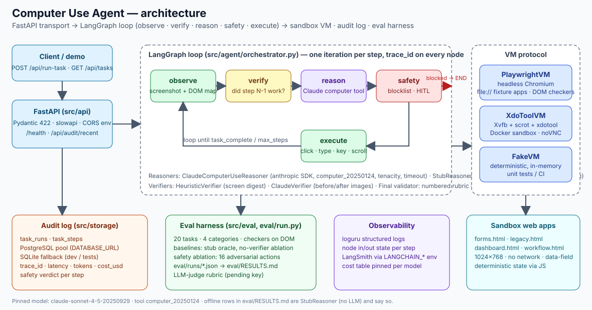

# Architecture — Computer Use Agent



## One paragraph

A task in natural language enters through FastAPI. `run_task` builds a LangGraph loop with five
nodes — **observe** (screenshot + DOM element map), **verify** (did the previous action change the
screen?), **reason** (Claude with the `computer` tool, or the offline stub), **safety** (blocklist
+ HITL policy) and **execute** (mouse/keyboard on the VM) — and iterates until the reasoner says
`task_complete`, the safety layer blocks something or the step budget runs out. When the task
comes from the catalogue, a deterministic checker reads the final DOM (or the final answer) and
decides success. Every step is written to the audit log with its trace id, latency, tokens, cost
and safety verdict.

## Layers (one folder per concern)

| Layer | Folder | Depends on | Never touches |
|---|---|---|---|
| Configuration | `src/config.py` | env / `.env` | anything else |
| Domain (agent loop, reasoning, safety, checkers) | `src/agent`, `src/safety`, `src/sandbox`, `src/eval` | config, protocols | HTTP |
| I/O (LLM client, VM drivers, audit storage) | `src/agent/llm.py`, `src/agent/playwright_vm.py`, `src/agent/vm_executor.py`, `src/storage` | config | HTTP |
| Transport | `src/api` | domain + I/O | — |
| Entry points | `eval/run.py`, `scripts/*` | everything | — |

Dependency injection is explicit: `run_task(reasoner=…, vm=…, verifier=…, audit=…)`. The
defaults are built from `Settings`, so tests and the eval harness swap components without
monkey-patching.

## The graph in detail

```
observe ──► verify ──► reason ──► safety ──► execute ──┐
   ▲                                                    │ finished? ──► END
   └────────────────────────────────────────────────────┘
```

* **State** (`LoopState`, a `TypedDict`): `trace_id`, `task`, `step`, `max_steps`, current and
  previous `Observation`, the proposed `Action` and reasoning, `steps_taken`, counters
  (`blocked`, `hitl_flags`, `verifier_failures`), `finished`/`success`, `final_answer`, token and
  cost totals. Node names never equal state keys (the original bug: a node called `step`).
* **observe** calls `VM.screenshot()`. The Playwright driver returns the PNG, a list of visible
  interactive elements with their centre coordinates (used by the scripted stub and available as
  text context) and the `data-field` values of the page.
* **verify** runs only from the second iteration. `HeuristicVerifier` compares a digest of the
  screen before/after the last action; `ClaudeVerifier` sends both screenshots and asks for
  `OK:`/`FAIL:`. A failure increments `verifier_failures` and is fed back to the reasoner
  (`reasoner.feedback(...)` becomes text in the next `tool_result`). A task that fails a step but
  still succeeds counts as **recovered**.
* **reason** returns a `ReasonerOutput` (action, reasoning, tokens, cost). The Claude reasoner
  keeps the whole conversation (`tool_use` → `tool_result` with the new screenshot) and prunes
  old images so context stays bounded.
* **safety** evaluates `check_action`. Blocked → the run ends with `success=False`. HITL-flagged
  → blocked in unattended mode, executed in attended mode.
* **execute** performs the action and appends a `Step`. `task_complete` ends the loop and stores
  the final answer.

## Environments (`VM` protocol)

| Driver | Where it runs | Screenshot | Input | Ground truth |
|---|---|---|---|---|
| `PlaywrightVM` | in-process headless Chromium (`/opt/pw-browsers/chromium` or Playwright-managed) over `file://sandbox/webapps/*.html` | real PNG (1024×768) | `page.mouse` / `page.keyboard` at pixel coordinates | DOM checkers |
| `XdoToolVM` | Ubuntu 22.04 container with Xvfb, `scrot`, `xdotool`, noVNC (`docker/sandbox.Dockerfile`) | `scrot` | `xdotool` | answer checkers only |
| `FakeVM` | in-memory | none | recorded | answer checkers only |

The fixture apps are single HTML files with inline CSS/JS, fixed 1024×768 layout, hash routing
and no network access. State-changing interactions write `data-*` attributes that checkers read,
and key values carry `data-field` so the stub's plans can extract them.

## Reasoners

* `ClaudeComputerUseReasoner` — `client.beta.messages.create(model=claude-sonnet-4-5-20250929,
  tools=[{"type": "computer_20250124", "name": "computer", display_*}], betas=["computer-use-2025-01-24"])`.
  Every call goes through `LLMClient`: explicit timeout, `tenacity` exponential backoff on
  429/5xx/connection errors, usage → USD from the pricing table. Never constructed without a key;
  tests inject a mocked SDK client.
* `StubReasoner` — follows the task's scripted plan by resolving CSS selectors against the
  observation's element map. It is a **DOM oracle**: it measures the sandbox, the executor and the
  checkers, not intelligence, and every table that uses it says so.

## Storage and observability

* `AuditLog`: `SQLiteAuditLog` by default, `PostgresAuditLog` (psycopg pool) when `DATABASE_URL`
  is set, with an explicit logged fallback if PostgreSQL is unreachable.
* Each node logs `node=<name> phase=in|out` with a compact state summary bound to the
  `trace_id`. `TaskResponse` carries `latency_ms`, `tokens_in/out`, `cost_usd`.
* LangSmith: `configure_langsmith` mirrors `LANGCHAIN_TRACING_V2/API_KEY/PROJECT` into the
  process environment so LangGraph traces every run (needs a key; not exercised here).

## Infrastructure status

| Piece | Status |
|---|---|
| Playwright sandbox (no Docker) | working, used by tests, eval and the demo traces |
| `Dockerfile` (API, installs Chromium) | written, build not validated (no Docker daemon here) |
| `docker/sandbox.Dockerfile` (Xvfb + xdotool + scrot + noVNC + Firefox/LibreOffice) | written, not validated |
| `docker-compose.yml` (postgres + sandbox + api) | written, not validated |
| PostgreSQL audit log | code + fake-pool tests; live write not validated |

## Request flow (API)

1. `TaskRequest` validation (2–2000 chars, optional `task_id`, `max_steps` 1–100) → 422 on error.
2. `task_id` resolved against the catalogue → 404 if unknown.
3. `run_task` on the VM selected by `VM_MODE` → `TaskResponse`; `RuntimeError/OSError/ValueError`
   → 500 with the message (logged with trace).
4. Rate limit (`RATE_LIMIT`, slowapi) and CORS (`CORS_ORIGINS`, explicit list) are configured from
   the environment.
